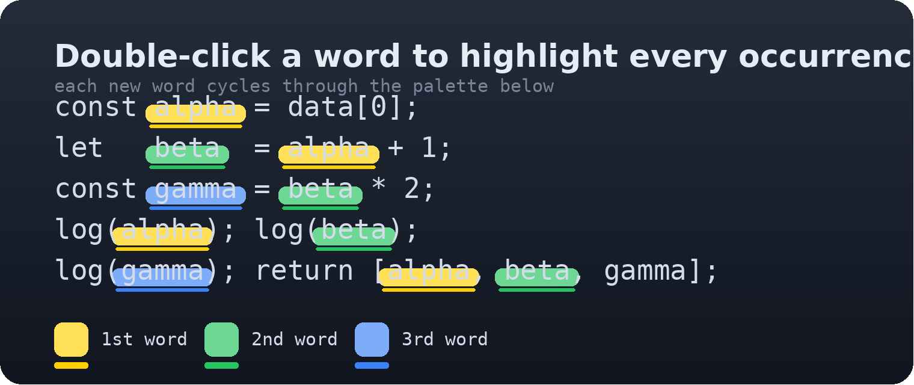

# Word Cycle Highlight

Spot every occurrence of a word in your code — and keep up to three different words in view at once.

## Why

Most highlighters only show you **one** word. This extension lets you track several: double-click `alpha`, then `beta`, then `gamma` — each word is highlighted everywhere it appears, and each new word automatically gets the **next color** from a rotating palette:

`yellow → green → blue → yellow → …`

## Features

- **One click, all occurrences** — double-click any identifier and every occurrence in the current file is highlighted instantly.
- **Multi-word tracking** — highlight up to three words simultaneously; each new word takes the next color, so you can visually tell them apart at a glance.
- **Click to toggle off** — double-click an already-highlighted word again to remove it.
- **Follows your edits** — highlights update live as you type or scroll, and each document keeps its own state.
- **Scrollbar overview markers** — tinted marks on the scrollbar show where the highlighted words are.
- **No JSON to edit** — colors, opacity and the underline are configured through a Quick Pick menu.

## Getting started

Select a word with the mouse (a double-click is the quickest way) to toggle its highlight. Alternatively use the commands or key bindings below.

### Commands

| Command | What it does |
| --- | --- |
| `Word Highlight: Highlight Current Word` | Add the word under the cursor to the highlight cycle |
| `Word Highlight: Clear Current Word` | Remove the word under the cursor |
| `Word Highlight: Clear All` | Clear every highlight in the active file |
| `Word Highlight: Configure Colors` | Open the Quick Pick to tune colors, opacity and underline |

### Default key bindings

| Keys | Action |
| --- | --- |
| `Alt+1` | Highlight the current word |
| `Alt+2` | Clear the current word |
| `Alt+3` | Clear all highlights in the file |

All key bindings can be remapped in VS Code Keyboard Shortcuts, and every command is available from the Command Palette (`Ctrl+Shift+P`).

## How the colors cycle

| Highlighted word | Color | Default |
| --- | --- | --- |
| 1st word | yellow | `#FFD000` |
| 2nd word | green | `#22C55E` |
| 3rd word | blue | `#3B82F6` |

The next highlighted word wraps back to yellow. Each color is configurable, together with the highlight **opacity** (default `0.34`) and the **2px underline** under each occurrence.

> **Configuring:** run `Word Highlight: Configure Colors` and pick a color or opacity in the Quick Pick. Settings are stored per-machine in VS Code global state — there is no `settings.json` entry to manage.

## What counts as a word

Words are matched as code identifiers (`letters`, `digits` and `_`, starting with a letter or `_`) and only whole-word matches are highlighted — `color` will not light up inside `backgroundColor`.

## Notes & tips

- Highlighting is mouse-selection based (e.g. double-click). Keyboard cursor movement does **not** trigger a toggle, but the commands and `Alt+1`/`Alt+2` always work.
- Highlights are tracked **per document**; switching files keeps each file's highlights intact.
- Long lists of highlights are also painted in the editor's overview ruler for quick navigation.

## Requirements

- VS Code `^1.74.0` or newer.

## License

[MIT](LICENSE)
